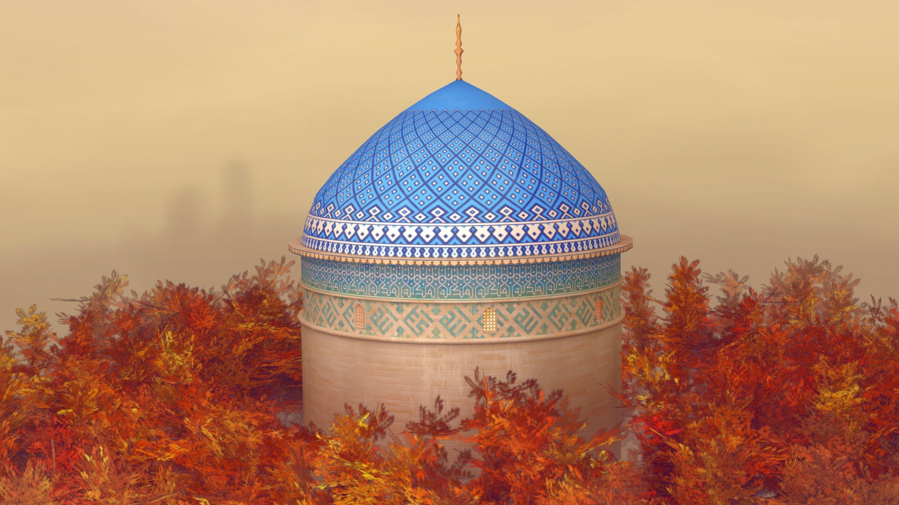

Procedural Islamic Dome and Patterns with Blender 3D and Geometry Nodes
=================

The repo contains some nodes for generating the Islamic dome you see here. The geometry is fully procedural and generated in Geometry Nodes. The textures are also fully procedural (except the caligraphy) and is generated in the material nodes.

To view the model, visit here: (link comming soon)
Blog post explaining the techinque: (link comning later)

---------
INFO

This was made originally for Blender Alpha 4.0 and 4.1. However the setup is also tested for Blender LTS 3.6
